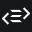
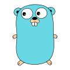
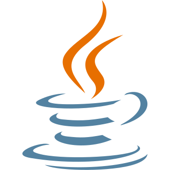
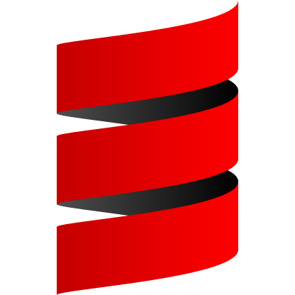
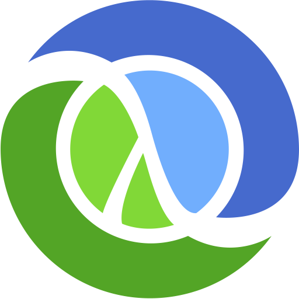
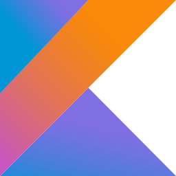
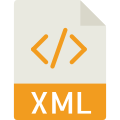
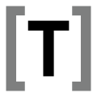
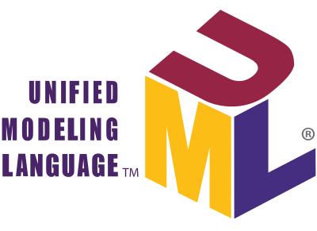

<!--
  ---
  note: navigate to `resources/references/documents/manuals` for verbose technical documentations.
  ---
-->
<!-- Showcases -->

<kbd>🎨</kbd> <kbd>Showcases</kbd>

<table class="showcases">
  <tr>
  <!-- Contributions -->
  <td>
  

<kbd>🤝</kbd> <kbd>Contributions</kbd>

  <table class="oss contribution">
    <tr>
    <td><kbd>🔎</kbd> <kbd>Type</kbd></td>
    <td><kbd>💬</kbd> <kbd>Language</kbd></td>
    </tr>
    <tr>
    <td><kbd>🤌</kbd> <a href="https://github.com/prateekmedia/appimagepool/commit/1a80d7618ced386e9ffa8465e09cb00efb3725ec">Translation</a></td>
    <td><kbd>🇨🇳</kbd> <kbd>Chinese</kbd></td>
    </tr>
    <tr>
    <td><kbd>🤌</kbd> <a href="https://github.com/prateekmedia/appimagepool/commit/1e8ae1c5088b8556e065b504fe2b5370366a5623">Translation</a></td>
    <td><kbd>🇧🇩</kbd> <kbd>Bangla</kbd></td>
    </tr>
    <tr>
    <td><kbd>💻</kbd> <a href="https://github.com/miguelpruivo/flutter_file_picker/commit/12edfd1d07a574f3849818eb3a1e08a6efb44578">Code</a></td>
    <td><kbd></kbd> <kbd>Dart</kbd></td>
    </tr>
    <tr>
    <td><kbd>💬</kbd> <a href="https://github.com/void-linux/void-packages/issues/38980">Feedback</a></td>
    <td><kbd>🔤</kbd> <kbd>English</kbd></td>
    </tr>
    <tr>
    <td><kbd>💬</kbd> <a href="https://github.com/toluschr/xdeb/issues/16">Feedback</a></td>
    <td><kbd>🔤</kbd> <kbd>English</kbd></td>
    </tr>
    <tr>
    <td><kbd>💬</kbd> <a href="https://github.com/microsoft/vscode/issues/166842">Feedback</a></td>
    <td><kbd>🔤</kbd> <kbd>English</kbd></td>
    </tr>
  </table>
  

  </td>
  <!-- /Contributions -->
  <!-- Statistics -->
  <td>
  

<kbd>📊</kbd> <kbd>Statistics</kbd>

  <table class="statistics">
    <tr>
    <td><kbd>🔎</kbd> <kbd>Platform</kbd></td>
    <td><kbd>💬</kbd> <kbd>Record</kbd></td>
    </tr>
    <tr>
    <td><kbd>🏎️</kbd> <a href="https://www.typeracer.com">Typeracer</a></td>
    <td><kbd></kbd></td>
    </tr>
  </table>
  

  </td>
  <!-- /Statistics -->
  </tr>
</table>

<!-- /Showcases -->
<!-- Profiles -->

<kbd>💼</kbd> <kbd>Profiles</kbd>

<table class="profiles">
  <td>
  <!-- Professional -->
  

<kbd>👔</kbd> <kbd>Professional</kbd>

  <table class="professional">
    <tr>
    <!-- Non Interactive -->
    <td>
    

<kbd>🤖</kbd> <kbd>Non Interactive</kbd>

    

ⓂⒶⓇⓀⒹⓄⓌⓃ

    🌐 Languages
    ├── 🤖 Machine Languages
    │   ├── 💾 General Purpose
    │   │   ├── 🧑‍💻 Programming Languages
    │   │   │   ├── 🥤 TypeScript 🍵 JavaScript ☕ CoffeeScript ⋚ PureScript
    │   │   │   │   └── 🛠️ Frameworks
    │   │   │   │       ├── 🆖 Angular
    │   │   │   │       ├── ⚛️ Electron
    │   │   │   │       ├── 🅽 NativeScript
    │   │   │   │       └── 🟢 Tauri
    │   │   │   ├── 🎯 Dart
    │   │   │   │   └── 🛠️ Frameworks
    │   │   │   │       └── 🐦 Flutter
    │   │   │   ├── 🍎 Swift
    │   │   │   │   └── 🛠️ Frameworks
    │   │   │   │       └── 🦅 SwiftUI
    │   │   │   ├── 🦫 Go
    │   │   │   ├── 🦀 Rust
    │   │   │   ├── 👑 Nim
    │   │   │   ├── 🇿 Zig
    │   │   │   ├── ☕ Java 🟥 Scala 𝛌 Clojure 🅺 Kotlin
    │   │   │   └── ♦️ Ruby
    │   │   ├── 🔖 Markup Languages
    │   │   │   ├── 🔗 HTML
    │   │   │   │   └── 📄 Stylesheet
    │   │   │   │       └── 📃 CSS
    │   │   │   │           └── 🛠️ Frameworks
    │   │   │   │               ├── 🗒️ SCSS SASS
    │   │   │   │               ├── 📝 LESS
    │   │   │   │               └── 🖊️ Stylus
    │   │   │   ├── 🖇️ XML
    │   │   │   ├── 🧷 YAML
    │   │   │   └── ⛓️ TOML
    │   │   ├── 📋 Query Languages
    │   │   │   └── 🔍 SQL
    │   │   │       └── 🗃️ Database Management Systems
    │   │   │           ├── 🪶 SQLite
    │   │   │           ├── 🐬 MySQL
    │   │   │           └── 🐘 PostgreSQL
    │   │   └── 🔄 Modeling Languages
    │   │       └── 🔁 UML
    │   └── 🔬 Domain Specific
    │       ├── 🔠 Text Processing Languages
    │       │   ├── 🐧 Gawk
    │       │   └── 🐪 Perl
    │       └── 📜 Scripting Languages
    │           ├── 🐃 Bash
    │           └── 🌕 Lua
    └── 💬 Natural Languages
        ├── 🔤 English
        ├── 🌏 East Asia
        │   ├── 🇨🇳 中文
        │   ├── 🇭🇰 廣東話
        │   └── 🇯🇵 日本語
        ├── 🌍 Middle East
        │   ├── 🇸🇦 اَلْعَرَبِيَّةُ
        │   └── 🇮🇷 فارسی
        └── 🌏 South Asia
            ├── 🇧🇩 বাংলা
            ├── 🇮🇳 অসমীয়া
            └── 🇧🇩 𑄌𑄋𑄴𑄟𑄳

ⓂⒶⓇⓀⒹⓄⓌⓃ
    

    

    </td>
    <!-- /Non Interactive -->
    <!-- Interactive -->
    <td>
      

<kbd>🧔</kbd> <kbd>Interactive</kbd>

      <blockquote>
        <!-- Languages -->
        

<kbd>🌐</kbd> <kbd>Languages</kbd>

        <blockquote>
          <!-- Machine Languages -->
          

<kbd>🤖</kbd> <kbd>Machine Languages</kbd>

          <blockquote>
            <!-- General Purpose -->
            

<kbd>💾</kbd> <kbd>General Purpose</kbd>

            <blockquote>
              <!-- Programming Languages -->
              

<kbd>🧑‍💻</kbd> <kbd>Programming Languages</kbd>

              <blockquote>
                <!-- Dart -->
                

<kbd></kbd> <kbd>Dart</kbd>

                <blockquote>
                  

<kbd>🛠️</kbd> <kbd>Frameworks</kbd>

                  <blockquote>
                    <kbd></kbd> <kbd>Flutter</kbd>
                  </blockquote>
                  

                </blockquote>
                

                <!-- /Dart -->
                <!-- Swift -->
                

<kbd></kbd> <kbd>Swift</kbd>

                <blockquote>
                  

<kbd>🛠️</kbd> <kbd>Frameworks</kbd>

                  <blockquote>
                    <kbd></kbd> <kbd>SwiftUI</kbd>
                  </blockquote>
                  

                </blockquote>
                

                <!-- /Swift -->
                <!-- TypeScript, JavaScript, CoffeeScript, PureScript -->
                

<kbd></kbd> <kbd>TypeScript</kbd> <kbd></kbd> <kbd>JavaScript</kbd> <kbd></kbd> <kbd>CoffeeScript</kbd> <kbd></kbd> <kbd>PureScript</kbd>

                <blockquote>
                  

<kbd>🛠️</kbd> <kbd>Frameworks</kbd>

                  <blockquote>
                    <kbd></kbd> <kbd>Angular</kbd> 
                    <kbd></kbd> <kbd>Electron</kbd> 
                    <kbd></kbd> <kbd>NativeScript</kbd> 
                    <kbd></kbd> <kbd>Tauri</kbd> 
                  </blockquote>
                  

                

                <!-- /TypeScript, JavaScript, CoffeeScript, PureScript  -->
                <!-- Go -->
                <kbd></kbd> <kbd>Go</kbd> 
                <!-- /Go -->
                <!-- Rust -->
                <kbd></kbd> <kbd>Rust</kbd> 
                <!-- /Rust -->
                <!-- Nim -->
                <kbd></kbd> <kbd>Nim</kbd> 
                <!-- /Nim -->
                <!-- Zig -->
                <kbd></kbd> <kbd>Zig</kbd> 
                <!-- /Zig -->
                <!-- Java, Scala, Clojure, Kotlin -->
                <kbd></kbd> <kbd>Java</kbd> <kbd></kbd> <kbd>Scala</kbd> <kbd></kbd> <kbd>Clojure</kbd> <kbd></kbd> <kbd>Kotlin</kbd> 
                <!-- /Java, Scala, Clojure, Kotlin -->
                <!-- Ruby -->
                <kbd></kbd> <kbd>Ruby</kbd> 
                <!-- /Ruby -->
              </blockquote>
              

              <!-- /Programming Languages -->
              <!-- Markup Languages -->
              

<kbd>🔖</kbd> <kbd>Markup Languages</kbd>

              <blockquote>
                <!-- HTML -->
                

<kbd></kbd> <kbd>HTML</kbd>

                <blockquote>
                  <!-- Stylesheet -->
                  

<kbd>📄</kbd> <kbd>Stylesheet</kbd>

                  <blockquote>
                    <!-- CSS -->
                    

<kbd></kbd> <kbd>CSS</kbd>

                    <blockquote>
                      

<kbd>🛠️</kbd> <kbd>Frameworks</kbd>

                      <blockquote>
                        <!-- SASS -->
                        <kbd></kbd> <kbd>SCSS</kbd> <kbd>SASS</kbd> 
                        <!-- /SASS -->
                        <!-- LESS -->
                        <kbd></kbd> <kbd>LESS</kbd> 
                        <!-- /LESS -->
                        <!-- Stylus -->
                        <kbd></kbd> <kbd>Stylus</kbd> 
                        <!-- /Stylus -->
                      </blockquote>
                      

                    </blockquote>
                    

                    <!-- /CSS -->
                  </blockquote>
                  

                  <!-- /Stylesheet -->
                </blockquote>
                

                <!-- /HTML -->
                <kbd></kbd> <kbd>XML</kbd> 
                <kbd></kbd> <kbd>YAML</kbd> 
                <kbd></kbd> <kbd>TOML</kbd> 
              </blockquote>
              

              <!-- /Markup Languages -->
              <!-- Query Languages -->
              

<kbd>📋</kbd> <kbd>Query Languages</kbd>

              <blockquote>
                

<kbd></kbd> <kbd>SQL</kbd>

                <blockquote>
                  <!-- Database Management Systems -->
                  

<kbd>🗃️</kbd> <kbd>Database Management Systems</kbd>

                  <blockquote>
                    <kbd></kbd> <kbd>SQLite</kbd> 
                    <kbd></kbd> <kbd>MySQL</kbd> 
                    <kbd></kbd> <kbd>PostgreSQL</kbd> 
                  </blockquote>
                  

                  <!-- /Database Management Systems -->
                </blockquote>
                

              </blockquote>
              

              <!-- /Query Languages -->
              <!-- Modeling Languages -->
              

<kbd>🔄</kbd> <kbd>Modeling Languages</kbd>

              <blockquote>
                <kbd></kbd> <kbd>UML</kbd>
              </blockquote>
              

              <!-- /Modeling Languages -->
            </blockquote>
            

            <!-- /General Purpose -->
            <!-- Domain Specific -->
            

<kbd>🔬</kbd> <kbd>Domain Specific</kbd>

            <blockquote>
              <!-- Text Processing Languages -->
              

<kbd>🔠</kbd> <kbd>Text Processing Languages</kbd>

              <blockquote>
                <!-- gawk -->
                <kbd></kbd> <kbd>Gawk</kbd> 
                <!-- /gawk -->
                <!-- perl -->
                <kbd></kbd> <kbd>Perl</kbd>
                <!-- /perl -->
              </blockquote>
              

              <!-- /Text Processing Languages -->
              <!-- Scripting Languages -->
              

<kbd>📜</kbd> <kbd>Scripting Languages</kbd>

              <blockquote>
                <!-- bash -->
                <kbd></kbd> <kbd>Bash</kbd> 
                <!-- /bash -->
                <!-- lua -->
                <kbd></kbd> <kbd>Lua</kbd> 
                <!-- /lua -->
              </blockquote>
              

              <!-- /Scripting Languages -->
            </blockquote>
            

            <!-- /Domain Specific -->
          </blockquote>
          

          <!-- /Machine Languages -->
          <!-- Natural Languages -->
          

<kbd>💬</kbd> <kbd>Natural Languages</kbd>

          <blockquote>
            <kbd>🔤</kbd> <kbd>English</kbd>
            <!-- East Asia -->
            

<kbd>🌏</kbd> <kbd>East Asia</kbd>

            <blockquote>
              <kbd>🇨🇳</kbd> <kbd>中文</kbd> 
              <kbd>🇭🇰</kbd> <kbd>廣東話</kbd> 
              <kbd>🇯🇵</kbd> <kbd>日本語</kbd> 
            </blockquote>
            

            <!-- /East Asia -->
            <!-- Middle East -->
            

<kbd>🌍</kbd> <kbd>Middle East</kbd>

            <blockquote>
              <kbd>🇸🇦</kbd> <kbd>اَلْعَرَبِيَّةُ</kbd> 
              <kbd>🇮🇷</kbd> <kbd>فارسی</kbd> 
            </blockquote>
            

            <!-- /Middle East -->
            <!-- South Asia -->
            

<kbd>🌏</kbd> <kbd>South Asia</kbd>

            <blockquote>
              <kbd>🇧🇩</kbd> <kbd>বাংলা</kbd> 
              <kbd>🇮🇳</kbd> <kbd>অসমীয়া</kbd> 
              <kbd>🇧🇩</kbd> <kbd>𑄌𑄋𑄴𑄟𑄳</kbd> 
            </blockquote>
            

            <!-- /South Asia -->
          </blockquote>
          

          <!-- /Natural Languages -->
        </blockquote>
        

        <!-- /Languages -->
      </blockquote>
      

    </td>
    <!-- /Interactive -->
    </tr>
  </table>
  

  <!-- /Professional -->
  <!-- Personal -->
  

<kbd>🏖️</kbd> <kbd>Personal</kbd>

  <table class ="personal">
    <!-- Overview -->
    <td>
      

<kbd>🔭</kbd> <kbd>Overview</kbd>

      ► <kbd>💬</kbd> <kbd>Linguist</kbd> <kbd>⌘</kbd> <kbd>Programmer</kbd>
      <table>
        <tr><td><kbd><spec>CHAD</spec></kbd></td><td>Crossplatform Hybrid Application Developer</td></tr>
        <tr><td><kbd><spec>MAD</spec></kbd></td><td>Multiplatform Application Developer</td></tr>
        <tr><td><kbd><spec>LAD</spec></kbd></td><td>Layout Agnostic Designer</td></tr>
      </table>
      

    </td>
    <!-- /Overview -->
    <!-- Motto -->
    <td>
      

<kbd>🥊</kbd> <kbd>Motto</kbd>

        ► <kbd>🧔</kbd> <kbd>Man</kbd> <kbd>🤖</kbd> <kbd>Machine</kbd> <kbd>💬</kbd> <kbd>Languages</kbd>
        <table>
          <tr>
            <td>Hardware</td>
            <td>Friends and Foes</td>
            <td>Anxiety</td>
            <td>Motivation</td>
          </tr>
          <tr>
            <td></td>
            <td></td>
            <td></td>
            <td></td>
          </tr>
        </table>
      

    </td>
    <!-- /Motto -->
  </table>
  

  <!-- /Personal -->
  </td>
</table>

<!-- /Profiles -->
